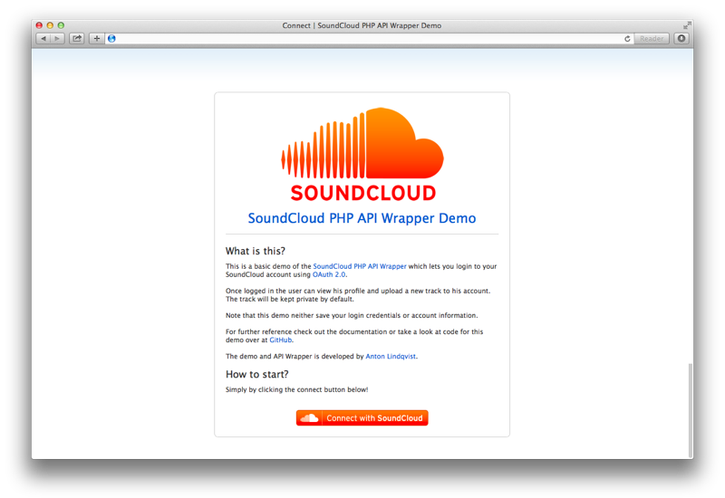

# SoundCloud PHP API Wrapper Demo Application

## Introduction

This is an demo application based on the [SoundCloud PHP API wrapper](https://github.com/mptre/php-soundcloud). It's written using the [CodeIgniter](http://codeigniter.com) framework.

## Getting started

In order to the get application up and running you'll need to match the criteria below.

1. You're running PHP5 or higher
3. You got [Redis](http://redis.io/) installed

Great! Lets get started.

### 1. Register your application

Head over to [SoundCloud](http://soundcloud.com/you/apps/new) and register your new application. You'll need to save the client id, client secret and redirect uri.

### 2. Create config.php

Copy the config sample using the command below. The command below assume you're standing in the root directory of this repository.

<pre><code>$ cp application/config/config.php.sample application/config/config.php</code></pre>

Open up the `config.php` file. And edit the following settings below.

* **cache_path:** temporary upload directory for the application. Must be writable by the server.
* **salt:** unique salt used to secure the user cookies. WordPress offers an excellent [salt generator](https://api.wordpress.org/secret-key/1.1/).
* **client_id:** your application client id.
* **client_secret:** your application client.
* **redirect\_uri:** your application redirect_uri.
* **redis::host:** optional redis host. Only needed if Redis isn't running on localhost.
* **redis::port:** optional redis port. Only needed if Redis isn't running on 6379.

### 3. Create htaccess

Copt the htaccess sample and make sure to edit the RewriteBase if other than `/`.

<pre><code>$ cp .htaccess.sample .htaccess</code></pre>

### 4. Voilà!

Your application should now be up and running.

## Files of interest

Below you'll find a list of files that might be of interest.

### application/controllers/sessions.php

#### Sessions::connect()

Generates the authorize URL.

#### Sessions::callback()

Handles the callback when a user has successfully been authorized over at SoundCloud. The supplied OAuth code is traded for an access token. The necessary data are then stored using Redis.

#### Sessions::refresh()

An access token will only stay valid for one hour. This method handles the refresh of the access token.

#### Sessions::dicsconnect()

Ends the current user session.

### application/controllers/tracks.php

#### Tracks::add()

Validates the supplied post data and uploads the track to SoundCloud.

### application/controllers/users.php

#### Users::show()

Get info about the logged in user.

### application/libraries/MY\_Controller.php

#### MY\_Controller::MY\_Controller()

Redirects non logged in users to the connect page and makes sure to refresh the token when needed.
